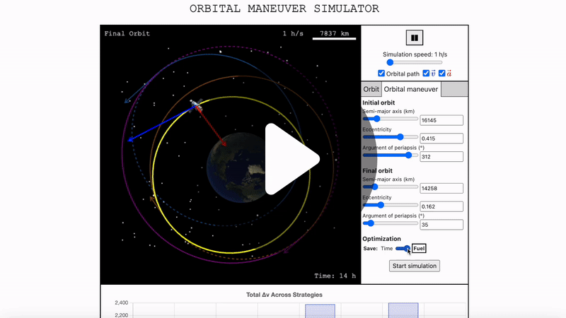

# Orbital Maneuver Simulator

The [Orbital Maneuver Simulator](https://www.orbitalmaneuversimulator.com/) is designed to model and visualize satellite orbits and coplanar orbital maneuvers. 
Whether you're a student, an aerospace enthusiast or a professional, this tool makes understanding orbital maneuvers more intuitive and interactive.

## Demo

<a href="https://www.youtube.com/watch?v=ykY9Iua_OEU">
  
</a>

# Project Architecture

## Tech Stack
 - **Frontend:** HTML, CSS, Javascript. Canvas.js for drawing the each frame in the 2D simulation. Chart.js for the charts in the information panel.
 - **Backend:** Built with Django. Deployed with DigitalOcean, Gunicorn, Nginx, Docker Compose and GitHub Actions.

## Important Components

### Frontend
`core/static/canvas.js` contains all of the logic for the simulation.
  - `OrbitSimulation` class
    - `eccentricAnomalie()` performs 8 iterations of Newton's method starting with the mean anomaly as the initial guess to estimate the eccentric anomaly of the satellite from Kepler's equation $M = E - e \cdot \sin(E)$, which is a transcendental equation meaning it does not have a closed-form solution. 8 iterations reduce the maximum error to below $1 \times 10^{-15}$, ensuring extremely smooth satellite movement.
  - `ManeuverSimulation` class
  - `Orbit` class

`core/static/main.js` contains all of the functions that handle user interactions.

`core/static/submitForm.js` handles sending data to the backend and receiving the processed response to then start the simulation.

### Backend
`core/utils.py` houses the key functions that process the user's data, makes all of the necessary calculations to provide the essential information needed for the simulation.
  - `ellipse_bounding_box(a, e, theta)` returns the length and width of a bounding box for a rotated ellipse. Calculates the roots of the derivatives of the parametric equations that define the rotated ellipse to find the four edges of the bouding box. Crucial for fitting the different orbits inside the simulation's boundaries.
  - `max_length_earth_pos(orbits)` returns the spatial scale and the earth's position based on the bounding boxes of all of the rotated ellipses that define the orbits.
  - `process_maneuver_data(start_orbit, end_orbit, optimization)` iterates through 8 strategies to find the best strategy for the orbital maneuver according to the optimization criteria provided by the user: *Save fuel* or *Save time*. Returns burns, orbits, the spatial scale and the earth's position defined by the chosen strategy. *(for the orbital maneuver simulation)*
  - `process_orbit_data(semi_major_axis, ecc, arg)` returns the spatial scale and the earth's position based on the bounding box of the ellipse that defines the orbit. *(for the orbit simulation)*

# Setup
Clone the repository:
```bash
git clone https://github.com/MathuC/orbital-maneuver-simulator.git
```
## Development Server
**Prerequisites:** Python 3
1. Create virtual environment:
```bash
python3 -m venv venv
```
2. Activate virtual environment
 - macOS/Linux:
```bash
source venv/bin/activate
```
 - Windows:
```batch
venv\Scripts\activate
```
3. Install dependencies:
```bash
pip install -r requirements.txt
```
4. Start the development server:
```bash
python manage.py runserver
```
5. Access the web app in your browser:
 - Open your browser and navigate to http://127.0.0.1:8000/

## Production Server
**Prerequisites:** Docker, Docker Compose
1. Start the production server:
```bash
docker compose up -d --build
```
2. Access the web app in your browser:
 - Open your browser and navigate to http://127.0.0.1:8080/

# Contributing
 - To inform us about bugs or about enhancement you think the web app can benefit from, [submit a new issue](https://github.com/MathuC/orbital-maneuver-simulator/issues/new) on GitHub.
 - To contribute to the code, fork the repository, commit your changes, squash your commits, and then submit a Pull Request.

# Future enhancements 
- [x] 3 more orbital maneuver strategies
- [x] Add *Save time* optimization criteria in the form
- [x] 4 more orbital maneuver strategies with circularization of orbit as the first step
- [ ] Unit tests
- [ ] Add inclination and longitude of the ascending node in the form
- [ ] Add initial true anomalie of the satellite in the form
